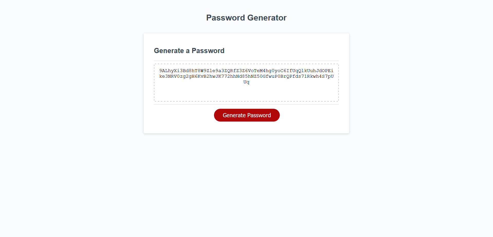

# uta-password-generator
deployment: https://brandonnorsworthy.github.io/uta-password-generator/

## About  
Generates random passwords built using characters based on criteria that was selected. This app will run in the browser and will feature dynamically updated HTML and CSS powered by JavaScript

## Demo  



- Asks user for length of password ```from 8 to 128 characters```
- Asks user for preference of ```Capital , Lowercase, Numeric or Special Characters```
- If user selects none password defaults to all caps
- Built reading array filled with prompts and character string so any characters can be added in at any time and code will still function fully.